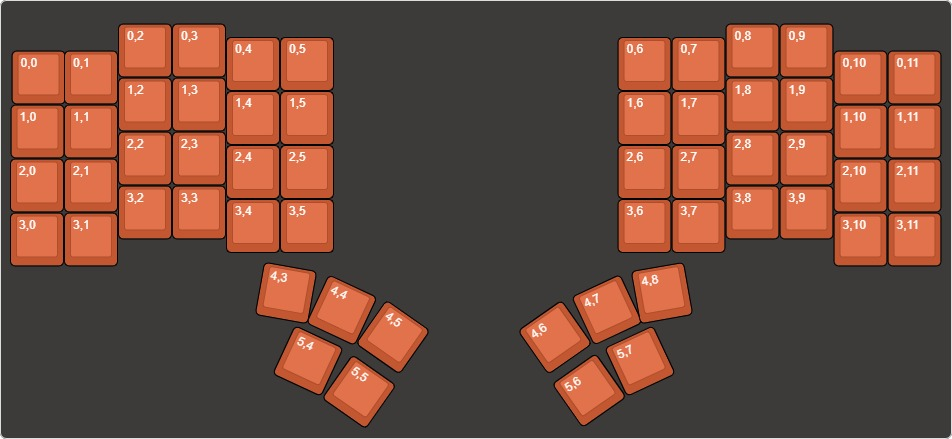

# Dactyl Manuform Thales (6x4 main + 5 thumb)

A handwired split [Dactyl-Manuform](https://github.com/tshort/dactyl-keyboard) variant
built by dumagnus. Each half has a 6-column x 4-row main finger area plus a 5-key thumb
cluster, for 58 keys total (29 per hand).

* Keyboard Maintainer: [dumagnus](https://github.com/duMagnus)
* Hardware Supported: RP2040 Zero (one per half), USB-C breakout for the split link
* Case / 3D model: designed in [Cosmos (ryanis.cool)](https://ryanis.cool/cosmos/beta#cm:CqYBChkSBRCAbyAnEgIgExICIAASADgeQICGisAHChYSBRCAYyAnEgIgExICIAASAxCwOzgKChsSBRCAVyAnEgIgExICIAASAxCwLzgJQIDwvAIKExIFEIBLICcSAiATEgIgABIAOB0KExIFEIA/ICcSAiATEgIgABIAODEKHBICICcSAiATEgYQoIAKIAASAhAwODJAgIaKwAcYAEDohaCu8FVI3ryfcAqUAQoXEhMQwIACQICAmAJIwpmglZC8AVBDOAgKGBIUEMCAAkCAgMwCSMKZoJWQvAFQhgFQOgoVEhAQQECAgCBI0JWA3ZD1A1ALUJ4CChQSEBBAQICA+AFI5pn8p5ALUFdQfwoVEhAQQECAgKQDSPCZxLXQMFB0UJUBGAIiCgjIARDIARhaIABAy4v8n9AxSK2R3I3BkwYQBhiEoAIiBhicBCCSCTgGWEtoAHIHEJwBkAGcAYIBBYEBxQIB)
  -- open the link to view or print the model.

## Hardware / wiring

* **Controller:** RP2040 Zero on each half.
* **Rows (both hands, top -> bottom):** GP3, GP4, GP5, GP6, GP7, GP8.
  * Rows 0-3 are the 4 main rows (all 6 columns populated).
  * Row 4 (GP7) is the thumb top row: 3 keys on the 3 innermost columns.
  * Row 5 (GP8) is the thumb bottom row: 2 keys on the 2 innermost columns.
* **Columns (inner -> outer):**
  * Left half:  GP29, GP28, GP27, GP26, GP15, GP14
  * Right half: GP14, GP15, GP26, GP27, GP28, GP29
  * On both halves matrix column 0 = innermost, column 5 = outermost.
* **Diodes:** COL2ROW.
* **Split link:** half-duplex serial on GP11 (USB-C breakout: D+ -> GP11, VCC -> 3V3, GND -> GND).
* **Underglow:** WS2812B addressable LEDs, data on **GP12**, powered from the reserved
  5V/GND wires.

### Matrix

The firmware matrix is 12 rows x 6 columns: left half = matrix rows 0-5, right half =
matrix rows 6-11. Verified physical positions (via `qmk console`):

* Outer top-left (Esc) = `[0,5]`; inner top-left (5) = `[0,0]`.
* Inner top-right (6) = `[6,0]`; outer top-right (grave) = `[6,5]`.
* Left thumb  top (L->R): `[4,2] [4,1] [4,0]`; bottom: `[5,1] [5,0]`.
* Right thumb top (L->R): `[10,0] [10,1] [10,2]`; bottom: `[11,0] [11,1]`.

### RGB underglow (split)

The LED strip is wired to the **right half only** (the serial slave). Because of this,
`keyboard.json` sets `rgblight.split_count` to `[0, 68]` (0 LEDs left, 68 right), which
implicitly enables `RGBLIGHT_SPLIT` so the master transmits RGB state across the link.
Without this, the RGB_* keycodes toggle state on the master but never reach the slave's
LEDs. `config.h` also defines `SPLIT_TRANSPORT_MIRROR` and `RGBLIGHT_SLEEP`.

Set `rgblight.led_count` (and the right value in `split_count`) in `keyboard.json` to match
your strip. If RGB state ever gets stuck after changing the LED count, clear the EEPROM
(`EE_CLR`, or a temporary `eeconfig_init()` in `keyboard_post_init_user`).

## VIA

The `via/` folder contains:

* `dactyl_via.json` -- the V3 definition to sideload in the [VIA](https://usevia.app) Design
  tab. Its physical layout comes from `kle/dactyl-manuform-thales.json` (converted via
  [keymap-layout-tools](https://nickcoutsos.github.io/keymap-layout-tools/)), with the key
  labels remapped to this firmware's real 12x6 matrix.
* `dactyl_manuform_thales__6x4___5_thumb_.layout.json` -- a saved VIA keymap backup. VIA
  stores layers in canonical matrix order (`index = row * 6 + col`).

## Build

Compile:

    qmk compile -kb handwired/magnuskeebs/dactyl_manuform_thales -km default

    # vial
    make handwired/magnuskeebs/dactyl_manuform_thales:vial

Note: `qmk compile -j 0` can hang under QMK-MSYS on Windows; omit `-j 0` or pass a real job
count. See the [build environment setup](https://docs.qmk.fm/#/getting_started_build_tools)
and [make instructions](https://docs.qmk.fm/#/getting_started_make_guide). New to QMK? Start
with the [Complete Newbs Guide](https://docs.qmk.fm/#/newbs).

There is also a `:default` (non-Vial) build. You do **not** need it to build `:vial` -- the two
are independent. It is only a diagnostic: if `:vial` ever fails to compile, try

    make handwired/magnuskeebs/dactyl_manuform_thales:default

If `:default` builds but `:vial` does not, the problem is in the Vial-specific files
(`keymaps/vial/`) rather than the shared keyboard definition.

Two prebuilt images are bundled here so the board can be re-flashed without recompiling:

* `dactyl_manuform_thales_vial.uf2` -- the Vial firmware (configure at <https://vial.rocks>).
* `dactyl_manuform_thales_default.uf2` -- the previous VIA/default firmware, kept as a
  recovery image.

Refresh the Vial image after changing the keymap:

    make handwired/magnuskeebs/dactyl_manuform_thales:vial
    cp handwired_magnuskeebs_dactyl_manuform_thales_vial.uf2 \
       keyboards/handwired/magnuskeebs/dactyl_manuform_thales/dactyl_manuform_thales_vial.uf2

## Flashing

The **same** `dactyl_manuform_thales_vial.uf2` goes on **both** halves. Flash them **one at a
time**. Handedness is decided at runtime by which half is plugged into the computer
(`SPLIT_USB_DETECT`), so there is no "left" or "right" firmware -- the file is identical.
(In normal use, always connect the **left** half to the computer.)

For **each** half, in order:

1. **Unplug the cable between the two halves.** Flash a half only while it is isolated.
2. **Hold the inner-top key on that half, and -- while still holding it -- plug that half into
   the computer** (external USB-C port, not the inter-half connector). The key to hold is the
   top-row key closest to the center of the board:
   * Left half: hold **`5`**.
   * Right half: hold **`6`**.
   (This is Bootmagic Lite: it checks that key at power-on and jumps straight to the
   bootloader -- no need to open the case.)
3. A USB drive named **`RPI-RP2`** appears. Release the key and **drag
   `dactyl_manuform_thales_vial.uf2` onto it.** The half reboots automatically when the copy
   finishes.
4. Unplug it, then repeat steps 2-3 for the **other** half.
5. Reconnect the inter-half cable and plug the keyboard into the computer (left half) as usual.

**To go back** to the old firmware, do the same steps with
`dactyl_manuform_thales_default.uf2`.

> Note: the Bootmagic-Lite step is compile-verified but has not been tested on this physical
> board. If the `RPI-RP2` drive does not appear, use the fallback below.

### Fallback: physical buttons

If Bootmagic does not work, use the BOOT/RESET buttons on the isolated half: press and hold
**BOOT**, tap **RESET**, then release **BOOT**; the `RPI-RP2` drive appears. These buttons are
on the RP2040 Zero boards, which are inside the case -- reaching them can require opening
it. They are the guaranteed recovery method. Just be careful with the wiring. Using just one
finger to press both is a good technique: press the **BOOT** button (the left one), rock your
finger to the right in a way you keep pressing **BOOT** but also tap **RESET**, then release
**BOOT**.

## Bootloader

* **Bootmagic Lite (no case opening, works on an isolated half):** hold the half's inner-top
  key (`5` on the left, `6` on the right) while plugging that half into USB.
* **Buttons (guaranteed fallback):** hold **BOOT**, tap **RESET**, release **BOOT**.
* **Keycode (only with both halves connected and working normally):** `QK_BOOT` lives on the
  `_RAISE` layer -- hold `MO(2)` (right thumb) and press the outer top-row key. Note this
  triggers on the USB-connected (left) half, so it is not a way to flash the right half by
  itself.
